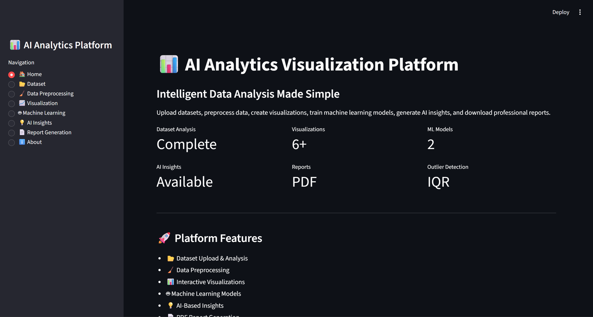
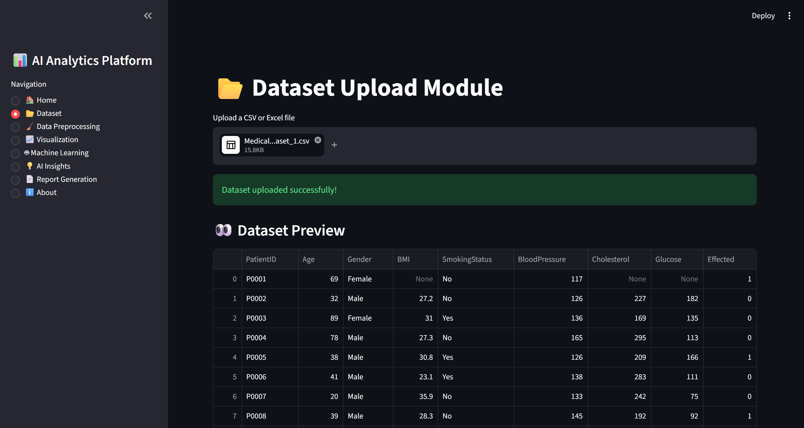
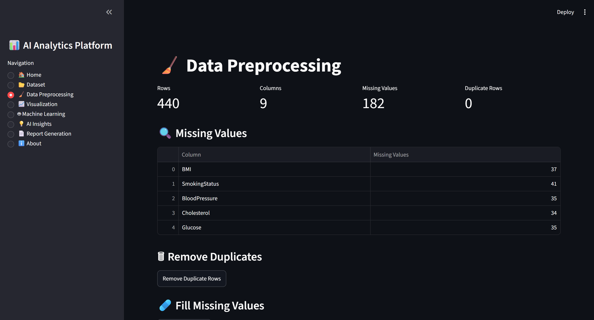
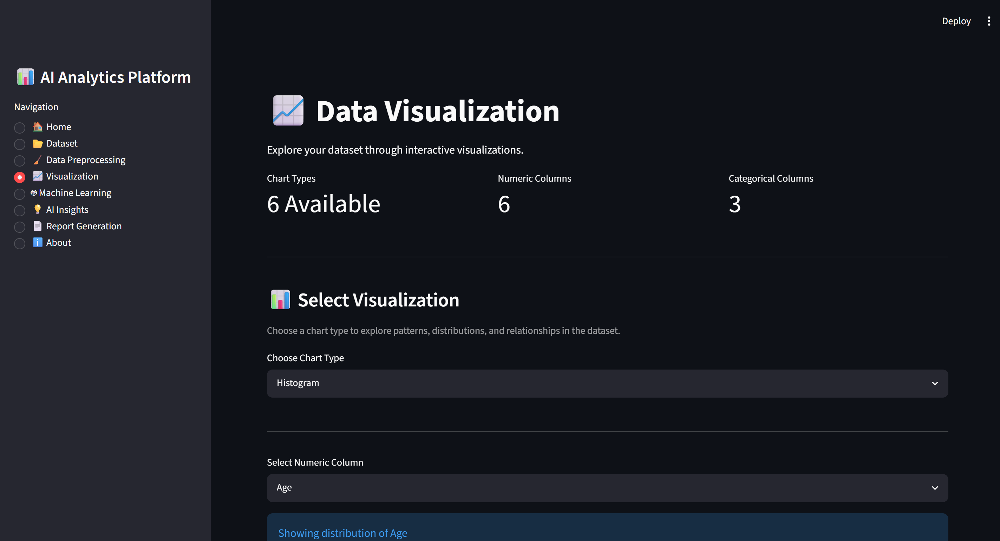
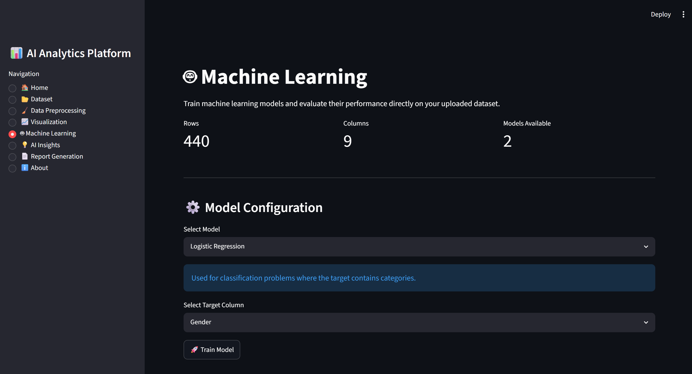
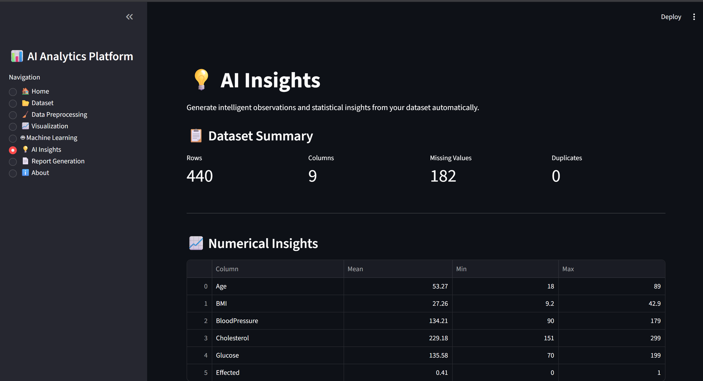
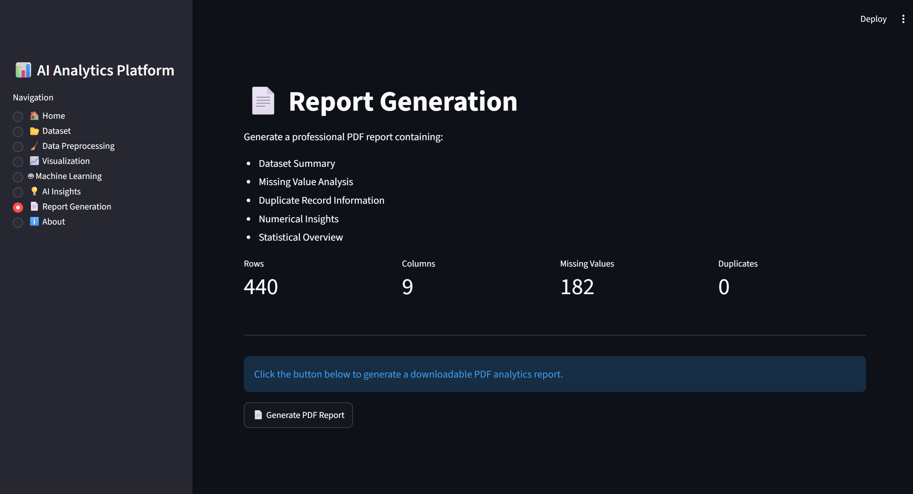
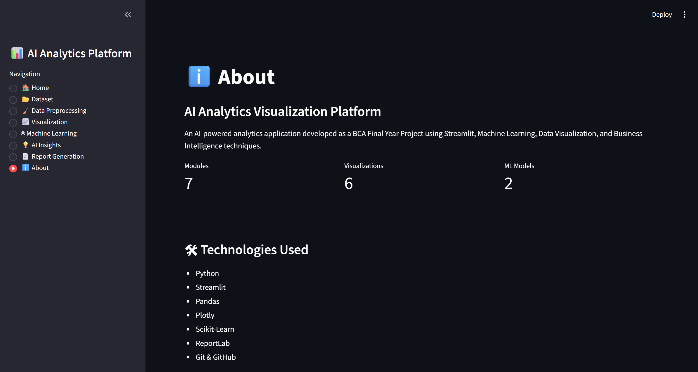

# 📊 AI Analytics Visualization Platform

An AI-powered web application for dataset analysis, preprocessing, interactive visualization, machine learning, intelligent insights, and PDF report generation.

---

## 📖 Overview

The **AI Analytics Visualization Platform** is a Streamlit-based web application developed as a **Bachelor of Computer Applications (BCA) Final Year Project**.

The platform enables users to upload datasets, perform data preprocessing, visualize data interactively, train machine learning models, generate intelligent insights, and download professional PDF reports through an easy-to-use interface.

This project combines concepts from:

* Data Analytics
* Data Visualization
* Machine Learning
* Business Intelligence
* Python Web Development

into one complete analytics platform.

---

## ✨ Features

### 📂 Dataset Analysis

* Upload CSV and Excel datasets
* Dataset preview
* Dataset dimensions
* Missing value detection
* Duplicate record detection
* Memory usage analysis
* Data type identification
* Statistical summary
* Numeric & categorical column classification

---

### 🧹 Data Preprocessing

* Missing value handling
* Duplicate row removal
* Outlier detection using IQR
* Cleaned dataset preview
* Download processed dataset

---

### 📈 Interactive Visualizations

* Histogram
* Bar Chart
* Pie Chart
* Box Plot
* Scatter Plot
* Correlation Heatmap

---

### 🤖 Machine Learning

* Logistic Regression
* Linear Regression
* Automatic categorical encoding
* Train/Test Split
* Accuracy Score
* Confusion Matrix
* Classification Report
* R² Score

---

### 💡 AI Insights

* Dataset summary
* Numerical insights
* Correlation analysis
* Smart health-related observations
* Automated statistical insights

---

### 📄 Report Generation

* Professional PDF reports
* Dataset summary
* Numerical statistics
* Missing value information
* Duplicate record information

---

## 🛠️ Technologies Used

| Category         | Technology   |
| ---------------- | ------------ |
| Language         | Python       |
| Frontend         | Streamlit    |
| Data Processing  | Pandas       |
| Visualization    | Plotly       |
| Machine Learning | Scikit-learn |
| Reporting        | ReportLab    |
| Version Control  | Git & GitHub |

---

## 📁 Project Structure

```text
AI-Analytics-Visualization-Platform/
│
├── assets/
├── data/
│   ├── sample/
│   └── uploaded/
│
├── models/
├── modules/
├── reports/
├── screenshots/
│   ├── home.png
│   ├── dataset.png
│   ├── preprocessing.png
│   ├── visualization.png
│   ├── machine_learning.png
│   ├── ai_insights.png
│   ├── report_generation.png
│   └── about.png
│
├── app.py
├── requirements.txt
├── README.md
└── .gitignore
```

---

## 🔄 Application Workflow

1. Upload Dataset
2. Analyze Dataset
3. Clean & Preprocess Data
4. Detect Outliers
5. Create Interactive Visualizations
6. Train Machine Learning Models
7. Generate AI Insights
8. Download PDF Report

---

## ⚙️ Installation

### Clone Repository

```bash
git clone https://github.com/wahidabegum866-wq/AI-Analytics-Visualization-Platform.git
```

Move into the project folder:

```bash
cd AI-Analytics-Visualization-Platform
```

---

### Create Virtual Environment

```bash
python -m venv .venv
```

---

### Activate Environment

**Windows**

```bash
.venv\Scripts\activate
```

---

### Install Dependencies

```bash
pip install -r requirements.txt
```

---

### Run the Application

```bash
streamlit run app.py
```

---

# 📸 Application Screenshots

## 🏠 Home Page



---

## 📂 Dataset Analysis



---

## 🧹 Data Preprocessing



---

## 📈 Data Visualization



---

## 🤖 Machine Learning



---

## 💡 AI Insights



---

## 📄 Report Generation



---

## ℹ️ About Page



---

# 🎯 Learning Outcomes

This project provided practical experience in:

* Data Cleaning
* Exploratory Data Analysis (EDA)
* Data Visualization
* Machine Learning
* Model Evaluation
* Report Generation
* Streamlit Development
* Git & GitHub
* Python Project Structure

---

# 🔮 Future Enhancements

* More Machine Learning Algorithms
* Feature Importance Analysis
* Model Comparison Dashboard
* Interactive Filtering
* Cloud Deployment
* User Authentication
* Generative AI Integration
* Export to Excel and PowerPoint

---

# 👩‍💻 Author

**Wahida Begum**

Bachelor of Computer Applications (BCA)

Final Year Project

AI Analytics Visualization Platform
